# IT Helpdesk System (GLPI) Project – PT Kino Indonesia Tbk

## 📌 Overview

Dokumentasi ini menjelaskan dan memberikan tampilan (interface) dari project sistem IT Helpdesk berbasis GLPI yang digunakan untuk mendukung proses IT Service Management (ITSM), khususnya dalam pengelolaan tiket dan asset IT.

---

# 🛠️ Interface Teknisi IT

## 🎫 Ticket Management

### 📷 Gambar 1 – Login Sistem

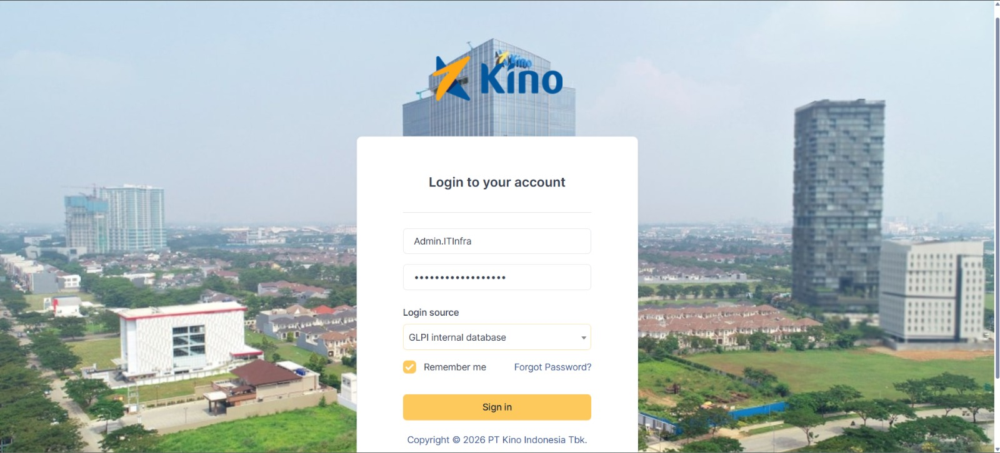

Halaman login yang digunakan oleh teknisi IT untuk mengakses sistem GLPI menggunakan kredensial yang telah terdaftar.

---

### 📷 Gambar 2 – Dashboard Ticket

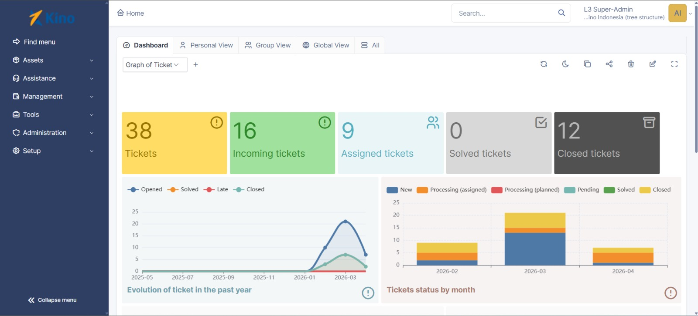

Dashboard utama yang menampilkan ringkasan tiket berdasarkan status seperti Open, Processing, Pending, Solved, dan Closed.

---

### 📷 Gambar 3 – Daftar Tiket

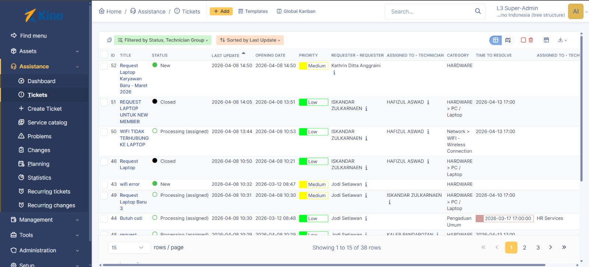

Menampilkan daftar seluruh tiket yang masuk, lengkap dengan informasi prioritas, kategori, dan status.

---

### 📷 Gambar 4 – Detail & Handling Tiket

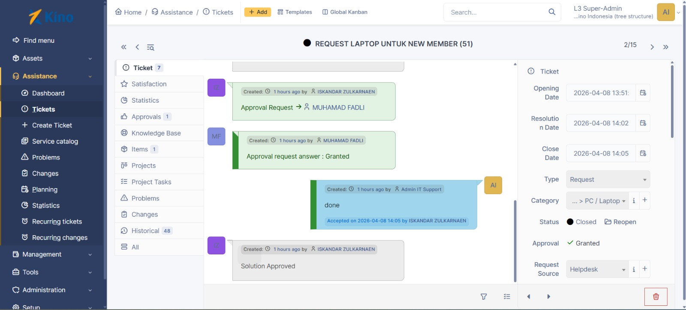

Halaman detail tiket yang digunakan teknisi untuk melakukan penanganan, update status, serta komunikasi dengan user.

---

## 💻 IT Asset Management

### 📷 Gambar 5 – Dashboard Asset

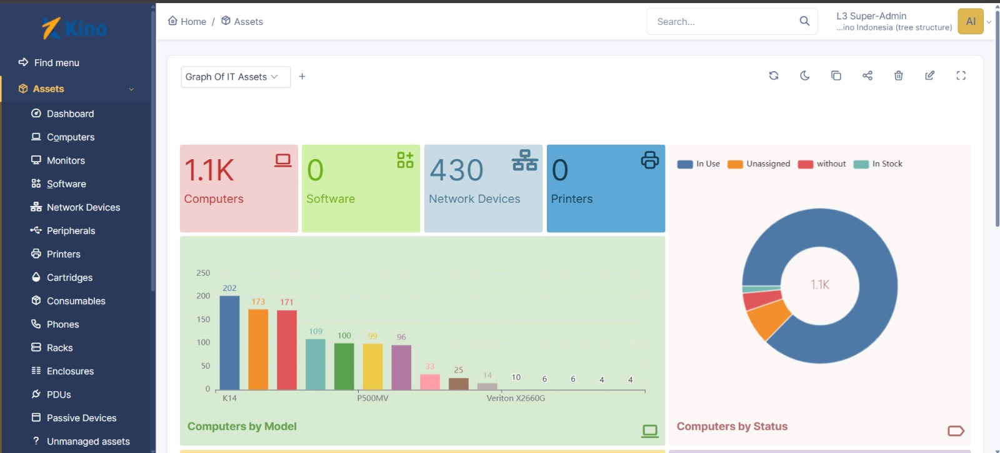

Menampilkan overview asset IT dalam bentuk grafik dan statistik untuk monitoring.

---

### 📷 Gambar 6 – Daftar Asset

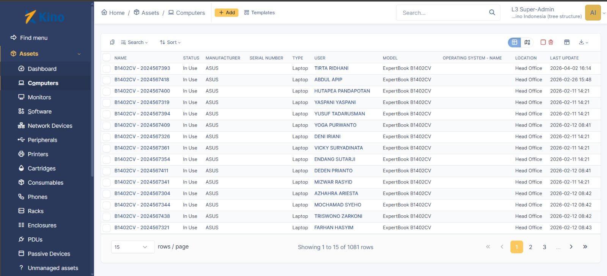

Menampilkan seluruh asset IT seperti laptop, PC, dan perangkat lainnya.

---

### 📷 Gambar 7 – Detail Asset

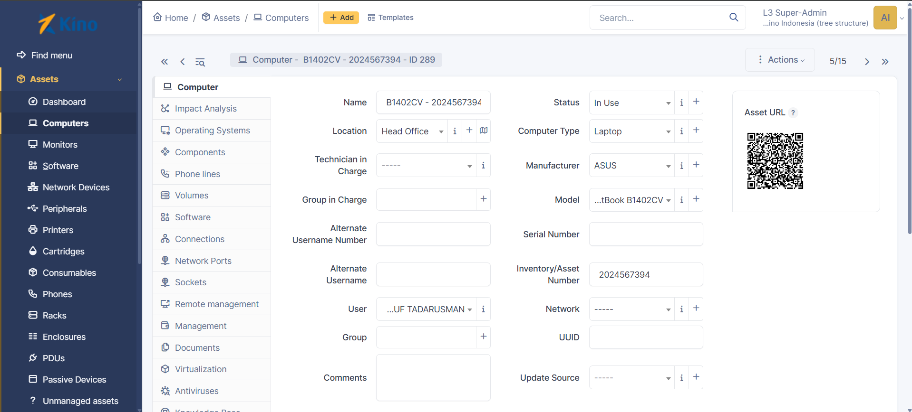

Menampilkan detail lengkap asset seperti spesifikasi, user, lokasi, dan status penggunaan.

---

# 👤 Interface User

### 📷 Gambar 8 – Portal User

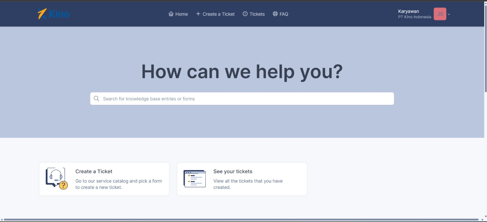

Halaman utama user untuk mengakses layanan IT Helpdesk.

---

### 📷 Gambar 9 – Katalog Layanan

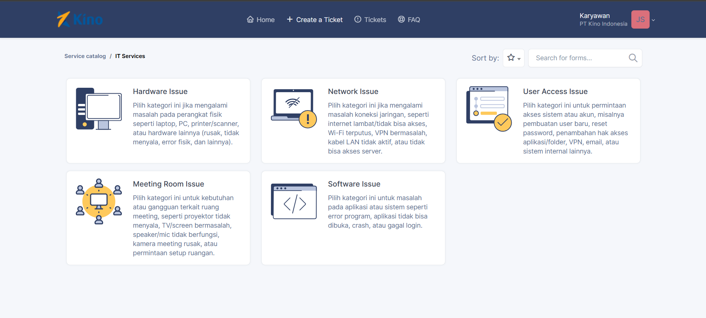

Menampilkan pilihan layanan atau kategori permasalahan yang dapat dipilih oleh user.

---

### 📷 Gambar 10 – Form Submit Tiket

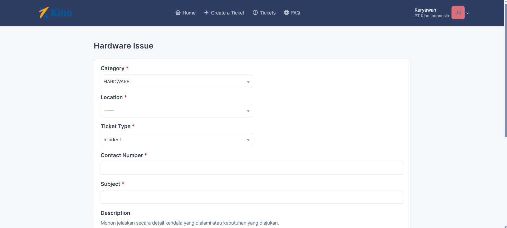

Form untuk membuat tiket baru dengan input deskripsi masalah dan kategori.

---

### 📷 Gambar 11 – Daftar Tiket User

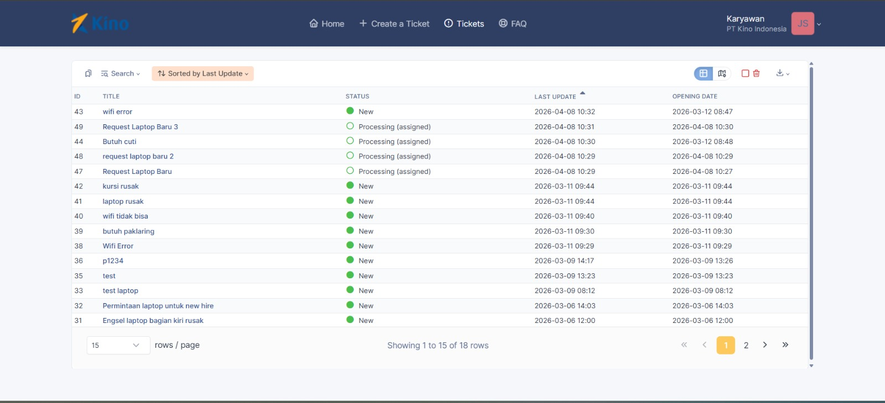

Menampilkan daftar tiket yang telah dibuat oleh user beserta statusnya.

---

### 📷 Gambar 12 – Detail Tiket User

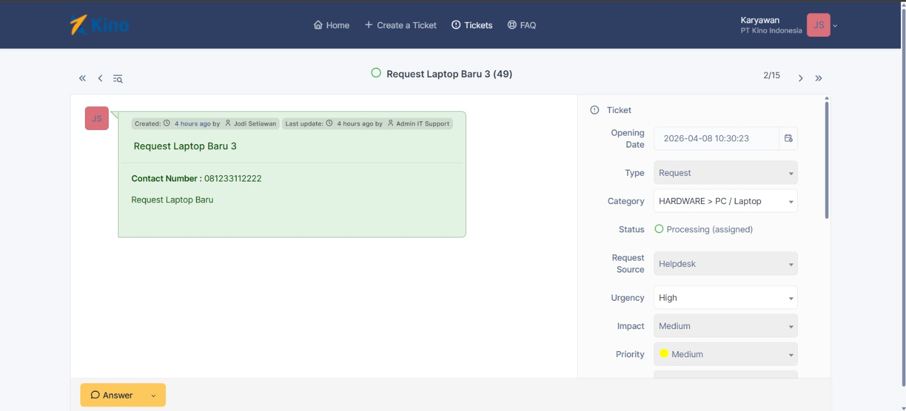

Menampilkan detail tiket dan komunikasi antara user dan teknisi.

---

# 🎯 Tujuan Akhir

Implementasi sistem IT Helpdesk berbasis GLPI memiliki tujuan:

* Efisiensi dalam pengelolaan tiket IT
* Monitoring performa teknisi dan SLA
* Pengelolaan asset IT secara terpusat
* Transparansi komunikasi antara user dan tim IT

---

# 👨‍💻 Author
Reynanda Al Ridwan Bintang Firdaus, Lulu Maudhuna Alfani
